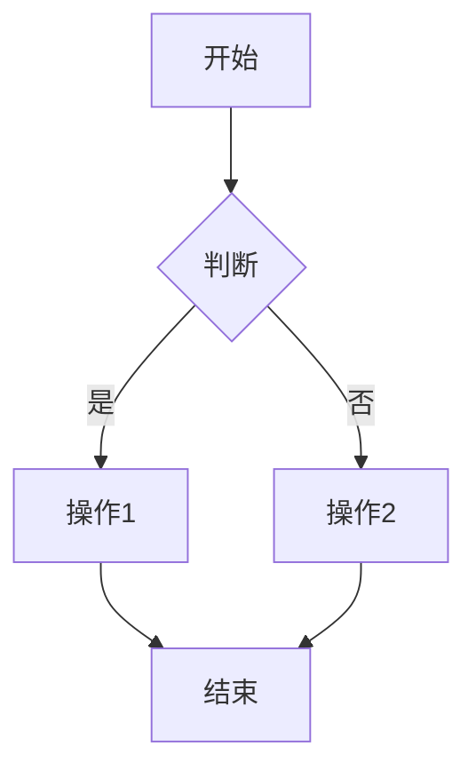

# [模块名称]功能设计

> **[模块]详细功能设计文档**

---

## 📋 模块概述

**模块名称**：[模块名称]  
**模块编号**：[M001/M002/等]  
**优先级**：[P0/P1/P2]  
**负责人**：[姓名]  
**状态**：[设计中/开发中/已完成]

---

## 🎯 功能目标

### 业务目标
[这个模块要解决什么业务问题]

### 用户价值
[对用户有什么价值]

---

## 👥 使用场景

### 场景1：[场景名称]
**场景描述**：[详细描述用户在什么情况下使用这个功能]

**用户操作流程**：
1. 用户打开[页面/功能]
2. 用户点击[按钮]
3. 系统[响应]
4. ...

---

### 场景2：[场景名称]
（继续添加其他场景...）

---

## 🔄 业务流程

### 主流程
```
用户 → [步骤1] → [步骤2] → [步骤3] → 完成
```

### 流程图（可选）


---

## 📊 功能清单

| 功能点 | 功能描述 | 优先级 | 状态 |
|--------|---------|--------|------|
| 功能1 | [描述] | P0 | ⚪ 未开始 |
| 功能2 | [描述] | P1 | ⚪ 未开始 |
| 功能3 | [描述] | P2 | ⚪ 未开始 |

---

## 🎨 界面设计

### 页面1：[页面名称]
**页面路径**：`/path/to/page`

**页面元素**：
- 元素1：[描述]
- 元素2：[描述]

**交互说明**：
- 点击[按钮]：[触发什么]
- 输入[字段]：[有什么限制]

---

### 页面2：[页面名称]
（继续添加...）

---

## 💾 数据设计

### 涉及的数据表
- `table1` - [用途]
- `table2` - [用途]

### 核心数据字段

#### [数据对象名称]
| 字段名 | 类型 | 必填 | 说明 |
|--------|------|------|------|
| field1 | string | 是 | [说明] |
| field2 | int | 否 | [说明] |
| field3 | boolean | 是 | [说明] |

---

## 🔌 接口设计

### 接口1：[接口名称]
**接口路径**：`POST /api/module/action`

**请求参数**：
```json
{
  "param1": "value1",
  "param2": "value2"
}
```

**响应数据**：
```json
{
  "code": 0,
  "message": "success",
  "data": {
    "result": "xxx"
  }
}
```

**业务规则**：
- 规则1：[说明]
- 规则2：[说明]

---

### 接口2：[接口名称]
（继续添加...）

---

## ✅ 业务规则

### 规则1：[规则名称]
**规则描述**：[详细说明这个规则]

**触发条件**：[什么情况下触发]

**规则处理**：[怎么处理]

---

### 规则2：[规则名称]
（继续添加...）

---

## 🚨 异常处理

### 异常1：[异常场景]
**触发条件**：[什么情况下出现]

**错误提示**：[显示什么提示]

**处理方案**：[怎么处理]

---

### 异常2：[异常场景]
（继续添加...）

---

## 🔐 权限控制

### 访问权限
- [角色1]：可以[操作]
- [角色2]：可以[操作]
- [角色3]：不能[操作]

### 数据权限
- [说明数据权限规则]

---

## 📝 开发要点

### 技术难点
1. [难点1]：[解决方案]
2. [难点2]：[解决方案]

### 性能要求
- 接口响应时间：< [X]ms
- 并发支持：[X]人同时在线

### 注意事项
- [注意事项1]
- [注意事项2]

---

## 🧪 测试要点

### 功能测试
- [ ] [测试点1]
- [ ] [测试点2]

### 边界测试
- [ ] [边界情况1]
- [ ] [边界情况2]

---

## 📅 开发计划

| 阶段 | 任务 | 预计工时 | 负责人 | 状态 |
|------|------|---------|--------|------|
| 设计 | 完成设计文档 | 0.5天 | - | ✅ |
| 开发 | 后端接口开发 | 2天 | - | ⚪ |
| 开发 | 前端页面开发 | 2天 | - | ⚪ |
| 测试 | 功能测试 | 1天 | - | ⚪ |

---

## 📖 相关文档

- 数据库设计：`03-系统架构/数据库设计.md`
- API文档：`08-资源文件/api/swagger.json`

---

## 🔄 变更记录

### v1.0 - [日期]
- 初始版本

### v1.1 - [日期]
- [变更内容]

---

**文档版本**：v1.0  
**创建日期**：[日期]  
**最后更新**：[日期]  
**维护人**：[姓名]

